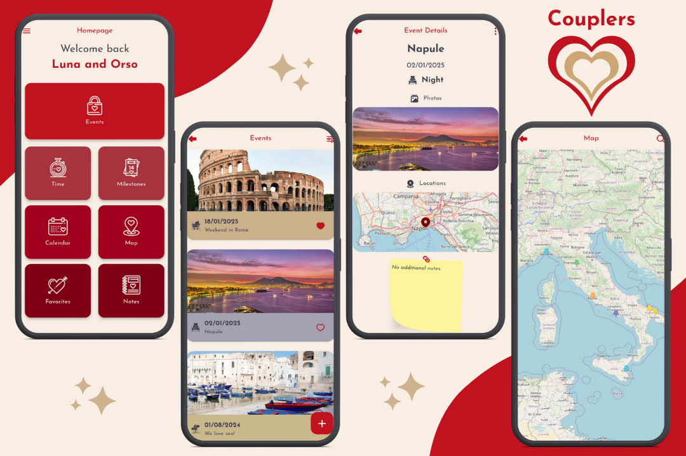

## Authors
- [@ndn21](https://github.com/ndenicolais)

## 📄 Description

This application was designed to allow couples of engaged to share and celebrate every special moment of their love story. From the engagement date onwards, you can add significant events such as the first meeting, anniversaries, trips, and other experiences that have marked your journey together. Share memories, photos, and thoughts to create a unique timeline that tells your love story.

## 💎 Release

The release of version 1.0.0 of the application is now available for download. You can download it from the following link:

[Download v1.0.0](https://github.com/ndenicolais/Couplers/releases/download/v1.0.0/Couplers_v1.0.0.apk)

## 🔑 Features
- A single account with the emails of both partners
- Data storage with Firestore Database
- Image storage with Supabase Storage
- Navigation with transition effects using get
- Detailed calculation of time spent together from the date of engagement
- Keep track of all your anniversaries (365 days) and dayversaries (100 days)
- A personalized calendar that displays all your milestones and events
- Events with dates, type, images, locations and notes
- A map showing all events and the event search function
- Favorites list of your events
- Notes to mark everything you need to remember
- Database export and import in JSON format
- Layout responsive to the device screen
- Light and dark theme variants
- English and Italian languages variants

## 🎨 Screenshots

## 📌 Packages
Below is a list of some of the most relevant packages:
- [get](https://pub.dev/packages/get)
- [flutter_screenutil](https://pub.dev/packages/flutter_screenutil)
- [google_fonts](https://pub.dev/packages/google_fonts)
- [cloud_firestore](https://pub.dev/packages/cloud_firestore)
- [supabase_flutter](https://pub.dev/packages/supabase_flutter)
- [intl](https://pub.dev/packages/intl)
- [shared_preferences](https://pub.dev/packages/shared_preferences)
- [table_calendar](https://pub.dev/packages/table_calendar)
- [free_map](https://pub.dev/packages/free_map)
