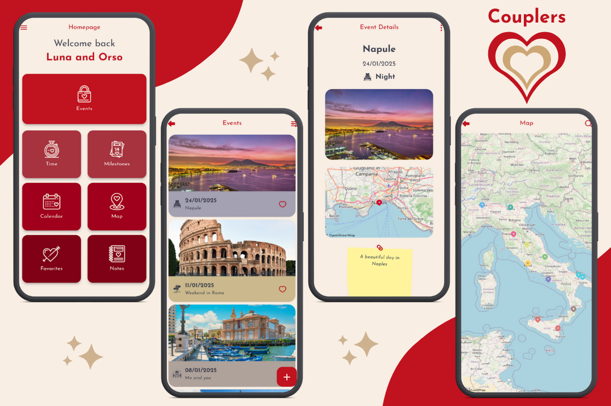

## 🔶 Authors
- [@ndn21](https://github.com/ndenicolais)

## 📄 Description

This app allows couples to share and celebrate every special moment of their love story. From the engagement date onwards, you can add significant events such as the first meeting, anniversaries, trips, and other experiences that have marked your journey together. All events can be viewed in different layouts, from the list to the calendar to the map. Share memories, photos, and thoughts to create a unique timeline that tells your wonderful love story.

## 💎 Release

App release 1.0.0 is available for download. You can download it from the following link:

[Download v1.0.0](https://github.com/ndenicolais/Couplers/releases/download/v1.0.0/Couplers_v1.0.0.apk)

## 🔑 Features
- A single account with both partners's email and unique password
- Data storage with Firestore Database
- Image storage with Supabase Storage
- Responsive design for all screens with ScreenUtil
- Navigation with transition effects with Get
- Light and dark theme variants
- English and Italian languages variants
- CRUD operations for your events
- Detailed calculation of time spent together from the date of engagement
- Keep track of all your anniversaries (365 days) and dayversaries (100 days)
- A personalized calendar that displays all your milestones and events
- Events with dates, type, images, locations and notes
- A map showing all events and the event search function
- Favorites list of your events
- Notes to mark everything you need to remember
- Download or share photos of each event
- Database export and import in JSON format

## 🎨 Screenshots

## 📌 Packages
Below is a list of some of the most relevant packages:
- [get](https://pub.dev/packages/get)
- [flutter_screenutil](https://pub.dev/packages/flutter_screenutil)
- [google_fonts](https://pub.dev/packages/google_fonts)
- [cloud_firestore](https://pub.dev/packages/cloud_firestore)
- [supabase_flutter](https://pub.dev/packages/supabase_flutter)
- [intl](https://pub.dev/packages/intl)
- [provider](https://pub.dev/packages/provider)
- [shared_preferences](https://pub.dev/packages/shared_preferences)
- [table_calendar](https://pub.dev/packages/table_calendar)
- [free_map](https://pub.dev/packages/free_map)
